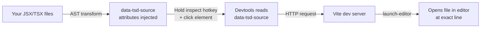

The source inspector lets you click any element in your app to open its source file in your editor. When activated, the devtools overlay highlights elements as you hover over them and shows their source file location. Click to open the file at the exact line.

## Requirements

Two things are needed for the source inspector to work:

- The `@tanstack/devtools-vite` plugin must be installed and running (dev server only)
- Source injection must be enabled: `injectSource.enabled: true` (this is the default)

Outside Vite, anything that injects the same `data-tsd-source` attribute drives the overlay just as well; see [Opening the File Somewhere Other Than Vite](#opening-the-file-somewhere-other-than-vite) for the click.

The feature only works in development. In production builds, source attributes are not injected.

## How It Works



The Vite plugin uses oxc-parser to parse your JSX/TSX files during development. It adds a `data-tsd-source="filepath:line:column"` attribute to every JSX element via MagicString. When you activate the source inspector and click an element, the devtools reads this attribute and sends a request to the Vite dev server. The server then launches your editor at the specified file and line using `launch-editor`.

## Activating the Inspector

There are two ways to activate the source inspector:

- **Hotkey**: Hold Shift+Alt+Ctrl (or Shift+Alt+Meta on Mac) — this is the default `inspectHotkey`. While held, the inspector overlay appears.
- **Settings panel**: The inspect hotkey can be customized in the devtools Settings tab.

The hotkey can also be configured programmatically:

```ts
<TanStackDevtools
  config={{
    inspectHotkey: ['Shift', 'Alt', 'CtrlOrMeta'],
  }}
/>
```

## Ignoring Files and Components

Not all elements need source attributes. Use the `ignore` config to exclude files or components:

```ts
import { devtools } from '@tanstack/devtools-vite'

export default {
  plugins: [
    devtools({
      injectSource: {
        enabled: true,
        ignore: {
          files: ['node_modules', /.*\.test\.(js|ts|jsx|tsx)$/],
          components: ['InternalComponent', /.*Provider$/],
        },
      },
    }),
  ],
}
```

Both `files` and `components` accept arrays of strings (exact match) or RegExp patterns.

## Click Action

By default, clicking an inspected element opens the file in your editor. You can change this to copy the source path to the clipboard instead using the `sourceAction` setting:

```ts
<TanStackDevtools
  config={{
    sourceAction: 'copy-path',
  }}
/>
```

| Value | Behavior |
| --- | --- |
| `"ide-warp"` | Opens the file in your editor at the exact line (default) |
| `"copy-path"` | Copies the `filepath:line:column` string to the clipboard |

This is useful in environments where the Vite dev server cannot reach your editor, or when you want to paste the path elsewhere.

## Opening the File Somewhere Other Than Vite

`"ide-warp"` requests `__tsd/open-source?source=<path:line:column>`, which the Vite plugin serves. If something else injects `data-tsd-source` — an SWC plugin under Next.js, for example — that endpoint does not exist, and the click appears to do nothing: the request 404s and the failure is swallowed.

`openSourceUrl` replaces the whole URL, so the click can reach whatever endpoint your host does have. It receives the clicked element's `data-tsd-source` value and returns an absolute URL or a path:

```ts
<TanStackDevtools
  config={{
    openSourceUrl: (source) =>
      `/api/open-editor?at=${encodeURIComponent(source)}`,
  }}
/>
```

The whole URL, not just its base, because a different host usually wants a different parameter shape. Next.js already serves its own editor endpoint, which takes the position split into three:

```ts
openSourceUrl: (source) => {
  const [, file, line, column] = /^(.*):(\d+):(\d+)$/.exec(source) ?? []
  const params = new URLSearchParams(
    file ? { file, line1: line, column1: column } : { file: source },
  )
  return `/__nextjs_launch-editor?${params}`
}
```

Leave it unset and the Vite endpoint is used, honouring `BASE_URL` as before. It is ignored under `sourceAction: "copy-path"`, which never makes a request.

## Editor Configuration

Most popular editors work out of the box via the `launch-editor` package. Supported editors include VS Code, WebStorm, Sublime Text, Atom, and more ([full list](https://github.com/yyx990803/launch-editor?tab=readme-ov-file#supported-editors)).

For unsupported editors, use the `editor` config:

```ts
devtools({
  editor: {
    name: 'My Editor',
    open: async (path, lineNumber, columnNumber) => {
      const { exec } = await import('node:child_process')
      exec(`myeditor --goto "${path}:${lineNumber}:${columnNumber}"`)
    },
  },
})
```
